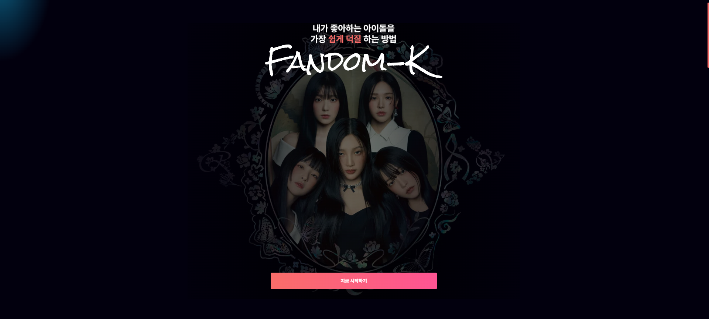
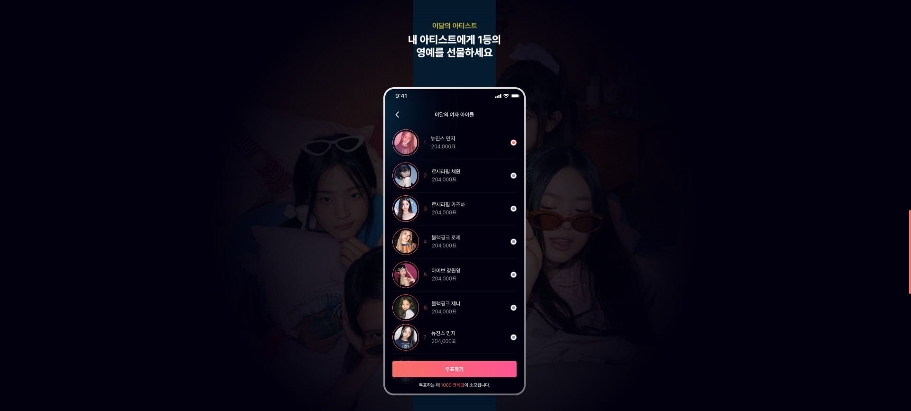
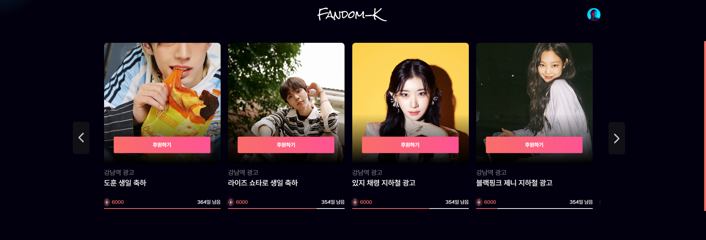
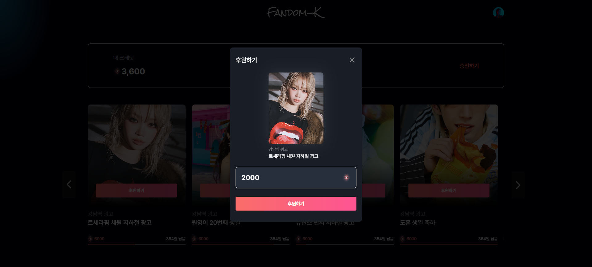
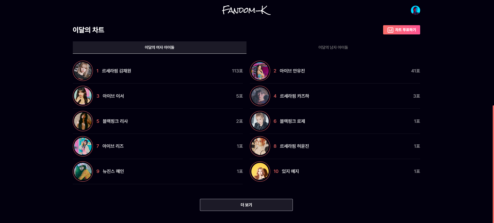
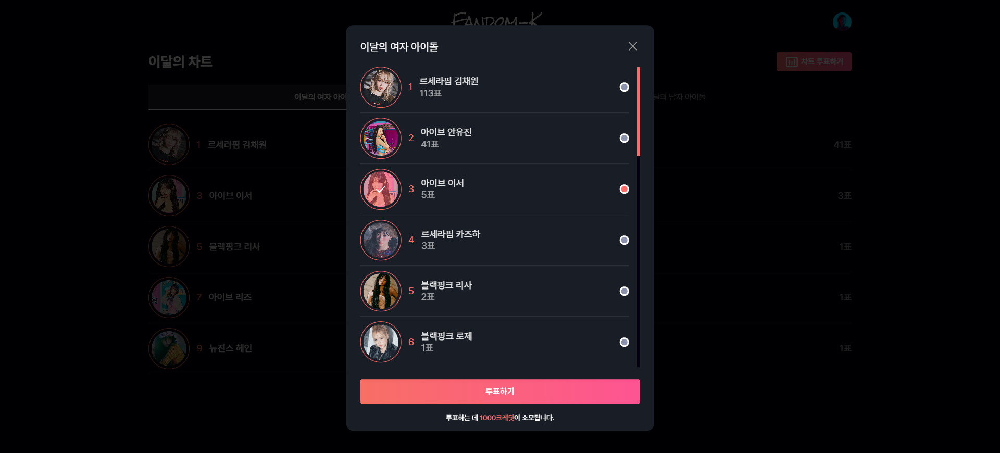
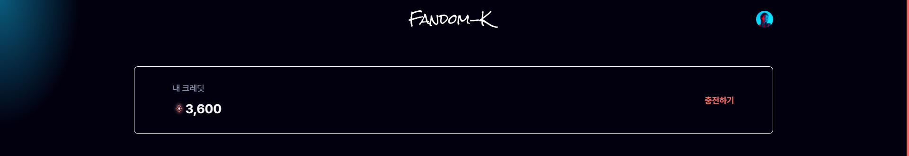
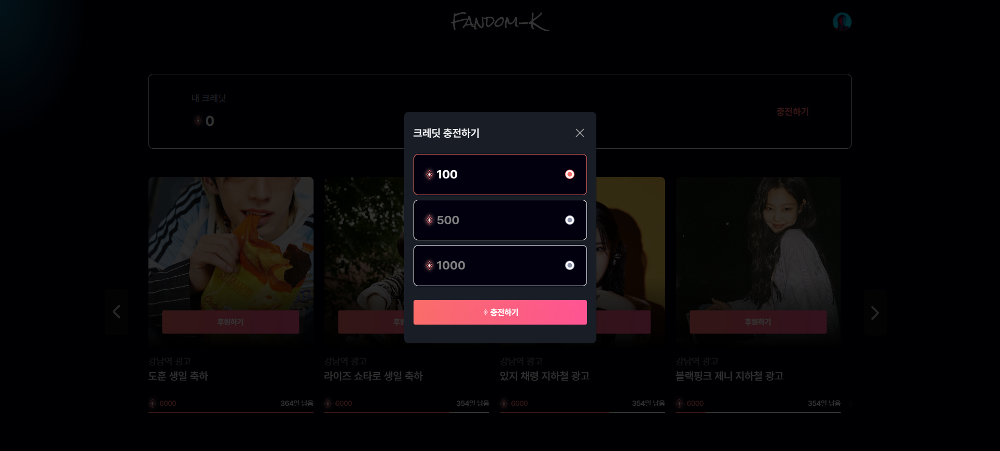
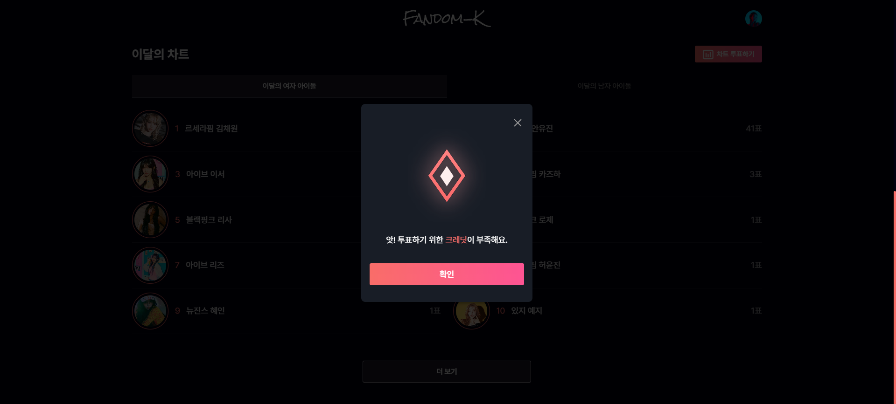
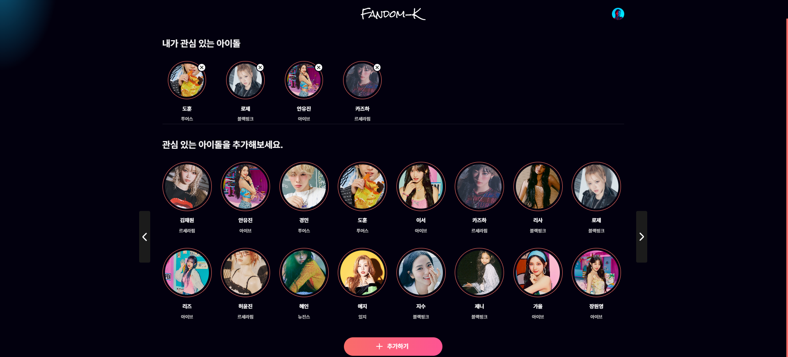

# Fandom-K


> 코드잇 스프린트 10기 Part2-2팀 FE 기초 프로젝트 ( 2024.09.24 ~ 2024.10.11 )<br />
> 아이돌 조공 플랫폼 **Fandom-K**

<br />

## 🔗 배포 URL

- [**Fandom-K**](https://codeit-fe10-fandom-k.vercel.app/)

<br />

## 👩‍💻 팀원 소개

<div align="center">

|                                  김지윤                                   |                                  김희진                                  |                                  오혁재                                   |                               정성현(팀장)                               |
| :-----------------------------------------------------------------------: | :----------------------------------------------------------------------: | :-----------------------------------------------------------------------: | :----------------------------------------------------------------------: |
|  |  |  |  |
|                     [@21ow](https://github.com/21ow)                      |                 [@devmanta](https://github.com/devmanta)                 |                [@duckjae12](https://github.com/duckjae12)                 |                  [@jsh1147](https://github.com/jsh1147)                  |

</div>

<br />

## 🤝 역할 분담

- **김지윤**
  - 목록 페이지(이달의차트), 모달(투표하기)
  - 전역 CSS, 리소스
- **김희진**
  - 목록 페이지(조공리스트), 모달(후원하기)
  - 크레딧 관리
  - 유저 플로우
- **오혁재**
  - 마이 페이지, 모달(크레딧부족)
  - 서버 데이터 관리 및 통신 API
- **정성현**
  - 랜딩 페이지, 목록 페이지(내크레딧), 모달(크레딧충전)
  - 초기 환경 구성, 라우팅, 레이아웃
  - 문서 작업

<br />

## 🛠 기술 스택

- **개발 환경**

  -   

- **빌드 및 배포**

  -   

- **FE 기술**

  -    
  -   
  -    

- **품질 관리**

  -   

- **협업 도구**

  -   

<br />

## 🗂️ 프로젝트 구조

```
codeit-FE10-Fandom-K
├─ .github                    : Github 설정
├─ .husky                     : Husky 설정
├─ public                     : Non-Compile 파일
└─ src                        : Compile 파일
    ├─ apis                   : 통신 API
    ├─ assets                 : 미디어
    │   ├─ icons              : 아이콘
    │   ├─ images             : 사진
    │   └─ readme             : README.md
    ├─ components             : 공용 컴포넌트
    │   └─ layout             : 레이아웃 컴포넌트
    ├─ constants              : 상수
    ├─ contexts               : 전역 상태
    ├─ hooks                  : 커스텀 훅
    ├─ pages                  : 페이지
    │   └─ page               : 개별 페이지
    │       └─ section        : 개별 섹션
    │           └─ components : 전용 컴포넌트
    ├─ styles                 : 전역 CSS
    └─ utils                  : 유틸리티 함수
```

<br />

## 📌 프로젝트 설명

### 랜딩 페이지

- 사이트에 접근할 경우 처음으로 만나는 페이지입니다.



<br />

- 모바일 뷰와 함께 사이트의 기능을 설명합니다.



<br />

### 조공 리스트(목록 페이지)

- 본인이 원하는 이벤트에 후원할 수 있습니다.



<br />

- 모달을 통해 후원이 진행됩니다.



<br />

### 이달의 차트(목록 페이지)

- 본인이 응원하는 아이돌에게 투표할 수 있습니다.



<br />

- 모달을 통해 투표가 진행됩니다.



<br />

### 크레딧 관리(목록 페이지)

- 페이지 상단에 보유한 크레딧을 표시합니다.



<br />

- 모달을 통해 크레딧을 충전할 수 있습니다.



<br />

- 크레딧이 부족할 경우 모달을 띄웁니다.



<br />

### 마이 페이지

- 관심 있는 아이돌을 등록할 수 있습니다.


